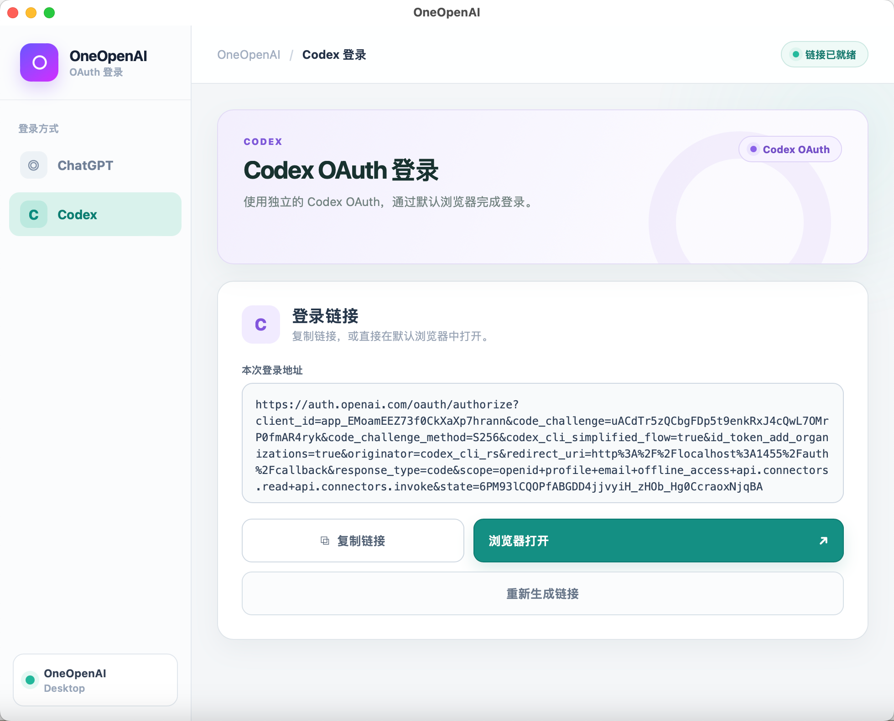

  

<h1 align="center">OneOpenAI</h1>

  

# OneOpenAI Desktop 免费开放 🎉

一个简单、干净的 OpenAI OAuth 桌面工具，现在免费开放下载。

目前支持：

- Codex Web OAuth 登录
- ChatGPT OAuth 登录
- 自动生成 OneOpenAI 固定 RT
- 使用 RT 随时刷新 Access Token
- 默认浏览器完成授权，不保存账号密码
- Claude、Gemini 登录功能正在开发中

没有复杂配置，没有设备码操作，打开软件即可完成登录。

项目完全免费，欢迎下载、反馈和参与开发：

https://github.com/oneopenai/oneopenai-desktop

如果你经常使用 Codex、ChatGPT API 或需要管理 OAuth Token，OneOpenAI Desktop 可以让整个过程简单很多。

  <a href="https://github.com/oneopenai/oneopenai-desktop/releases/latest"><strong>下载最新版</strong></a>
  ·
  <a href="https://github.com/oneopenai/oneopenai-desktop/issues">反馈问题</a>

## 支持平台

- macOS Apple Silicon
- Windows 10/11 x64

## 功能

- ChatGPT 网页 OAuth 登录
- Codex 网页 OAuth 登录
- 生成并复制固定的 `oneopenai_rt_...`
- 刷新 Access Token

## 使用

1. 下载并安装 OneOpenAI。
2. 选择 ChatGPT 或 Codex。
3. 在浏览器完成登录。
4. 回到 OneOpenAI 复制生成的凭证。
